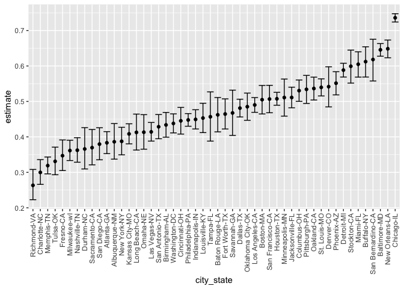
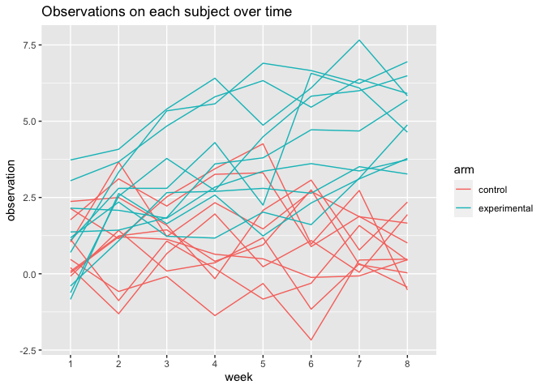
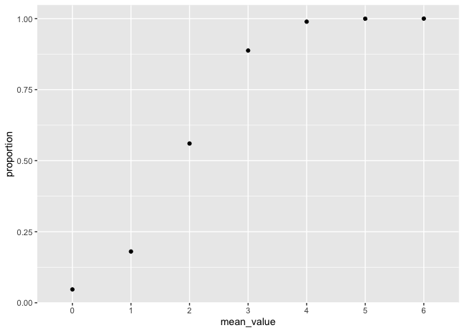
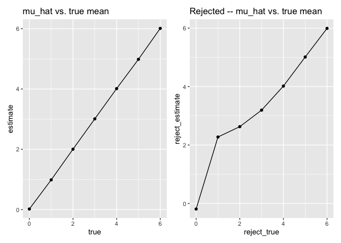

p8105\_hw5\_yl4613
================
YuechenLiu
11/17/2020

# HW5

## Problem 1

Read in the data.

``` r
homicide_df = 
  read.csv('data/homicide-data.csv') %>% 
  mutate(
    city_state = str_c(city, state, sep = "-"),
    resolved = case_when(
      disposition == "Closed without arrest" ~ "unsolved",
      disposition == "Open/No arrest" ~ "unsolved",
      disposition == "Closed by arrest" ~ "solved"
    )
  ) %>% 
  select(city_state, resolved) %>% 
  filter(city_state != "Tulsa-AL")
```

Let’s look at this a bit

``` r
aggregate_df = 
  homicide_df %>% 
  group_by(city_state) %>% 
  summarize(
    hom_total = n(),
    hom_unsolved = sum(resolved == 'unsolved')
  )
```

    ## `summarise()` ungrouping output (override with `.groups` argument)

Can I do a prop test for a single city?

``` r
prop.test(
  aggregate_df %>% 
    filter(city_state == "Baltimore-MD") %>% pull(hom_unsolved),
  aggregate_df %>% 
    filter(city_state == "Baltimore-MD") %>% pull(hom_total)) %>% 
  broom::tidy()
```

    ## # A tibble: 1 x 8
    ##   estimate statistic  p.value parameter conf.low conf.high method    alternative
    ##      <dbl>     <dbl>    <dbl>     <int>    <dbl>     <dbl> <chr>     <chr>      
    ## 1    0.646      239. 6.46e-54         1    0.628     0.663 1-sample… two.sided

Try to iterate …..

``` r
results_df =
  aggregate_df %>% 
  mutate(
    prop_tests = map2(.x = hom_unsolved, .y = hom_total, ~prop.test(x = .x, n = .y)),
    tidy_tests = map(.x = prop_tests, ~broom::tidy(.x))
  ) %>% 
  select(-prop_tests) %>% 
  unnest(tidy_tests) %>% 
  select(city_state, estimate, conf.low, conf.high)
```

``` r
results_df %>% 
  mutate(city_state = fct_reorder(city_state, estimate)) %>% 
  ggplot(aes(x = city_state, y = estimate)) +
  geom_point() + 
  geom_errorbar(aes(ymin =  conf.low, ymax = conf.high)) +
  theme(axis.text.x = element_text(angle = 90, vjust = 0.5, hjust = 1))
```

<!-- -->

## Problem 2

Import and tidy the dataset

``` r
path_df = 
  tibble(
  path = list.files('data_2')) %>% 
  mutate(path = str_c('data_2/',path),
         data = purrr::map(.x = path, ~read.csv(.x))) %>% 
  unnest(data) %>% 
  separate(
    path, into = c('data', 'info'),sep = '/'
  ) %>% 
  separate(
    info, into = c('information', 'csv'), sep = '.csv'
  ) %>% 
  select(-data, -csv) %>% 
  separate(
    information, into = c('arm', 'id'), sep = '_'
  ) %>% 
  mutate(
    arm = case_when(
      arm == "con" ~ "control",
      arm == "exp" ~ "experimental")) %>% 
  pivot_longer(
    week_1:week_8,
    names_to = 'week',
    names_prefix = 'week_',
    values_to = 'observation')
###End of tidying
```

Spaghetti plot—

``` r
path_df %>% 
  ggplot(
  aes(x = week, y = observation, group = interaction(id, arm)))+
  geom_line(aes(color = arm))+ 
  labs(title = 'Observations on each subject over time')
```

<!-- -->

Comment: Two arms of subjects have very similar initial observations.
However, after 8 weeks, the experimental group has generally higher
observations, while control group observations has almost no change in
range of value between its subjects.

## Problem 3

``` r
n = 30
sigma = 5
```

Set up function–given n, mu, sigma. return mean and p-value.

``` r
sim_1 = function(n, mu, sigma) {  
  x = rnorm(n, mean = mu, sd = sigma)
  t_test = broom::tidy(t.test(x))
  result =
    tibble(
    mu_hat = mean(x),
    pvalue = t_test$p.value
    )
  return(result)
}
```

Function: generate 5000 datasets. Use a for loop.

``` r
sim_5000 = function(mean) {
  output_5000 = vector("list", length = 5000)
  for (i in 1:5000) {
    output_5000[[i]] = sim_1(n, mean, sigma)}
  result_5000 = bind_rows(output_5000)
  return(result_5000)
  }
```

Simulation—mu = 0 (5000 times)

``` r
set.seed(1911)
sim_0 = sim_5000(0)
```

Function–showing the proportion of times the null was rejected

``` r
proportion = function(sim) {
  reject = 
    sum(sim$pvalue < 0.05) / 5000
  return(reject)
}
```

Repeat the above for mu = {1,2,3,4,5,6} (Total result: a list including
when mu from 0 to 6)

``` r
set.seed(1911)
sim_16 = vector("list", length = 7)
for (i in 0:6) {
  sim_16[[i+1]] = proportion(sim_5000(i))
}
means <- LETTERS[1:7]
df16 = as.tibble(sim_16, .name_repair = ~means) %>% 
  pivot_longer(A:G,
               names_to = 'mu',
               values_to = 'proportion') %>% 
  mutate(
    mean_value = case_when(
      mu == 'A'~ '0',
      mu == 'B'~ '1',
      mu == 'C'~ '2',
      mu == 'D'~ '3',
      mu == 'E'~ '4',
      mu == 'F'~ '5',
      mu == 'G'~ '6')) %>%
  select(-mu)
```

    ## Warning: `as.tibble()` is deprecated as of tibble 2.0.0.
    ## Please use `as_tibble()` instead.
    ## The signature and semantics have changed, see `?as_tibble`.
    ## This warning is displayed once every 8 hours.
    ## Call `lifecycle::last_warnings()` to see where this warning was generated.

Plot time\!

``` r
##Make a plot showing the proportion of times the null was rejected (the power of the test) on the y axis and the true value of μ on the x axis

df16 %>%
  mutate(
  mean_value = as.double(mean_value))
```

    ## # A tibble: 7 x 2
    ##   proportion mean_value
    ##        <dbl>      <dbl>
    ## 1      0.047          0
    ## 2      0.180          1
    ## 3      0.560          2
    ## 4      0.888          3
    ## 5      0.989          4
    ## 6      1.00           5
    ## 7      1              6

``` r
ggplot(df16, aes(mean_value, proportion))+geom_point()+
  geom_line()
```

    ## geom_path: Each group consists of only one observation. Do you need to adjust
    ## the group aesthetic?

<!-- --> We
can see from the plot that when effect size (mu) increases, the power
also in creases. The power will be closer to 1 infinitely.

Make a plot showing the average estimate of μ on the y axis and the true
value of μ on the x axis. Make a second plot (or overlay on the first)
the average estimate of μ̂ only in samples for which the null was
rejected on the y axis and the true value of μ on the x axis.

``` r
##Plot1
set.seed(1911)
true_mu = 
  tibble(
    estimate = c(mean(sim_5000(0)$mu_hat),mean(sim_5000(1)$mu_hat),mean(sim_5000(2)$mu_hat),mean(sim_5000(3)$mu_hat),mean(sim_5000(4)$mu_hat),mean(sim_5000(5)$mu_hat),mean(sim_5000(6)$mu_hat))
  )
true_mu$true <- 0:6


plot1 = ggplot(true_mu, aes(true, estimate))+geom_point()+
  geom_line()+ 
  labs(title = 'mu_hat vs. true mean')
```

``` r
##Plot2

set.seed(1911)
onlyreject = function(sim) {
  a = 
    sim %>% 
    filter(sim$pvalue < 0.05)
  mean_reject = mean(a$mu_hat)
  return(mean_reject)
}

true_mu_reject = 
  tibble(
    reject_estimate = c(onlyreject(sim_5000(0)), onlyreject(sim_5000(1)), onlyreject(sim_5000(2)), onlyreject(sim_5000(3)), onlyreject(sim_5000(4)), onlyreject(sim_5000(5)), onlyreject(sim_5000(6))))
true_mu_reject$reject_true <- 0:6

plot2 = ggplot(true_mu_reject, aes(reject_true, reject_estimate))+geom_point()+
  geom_line()+ 
  labs(title = 'Rejected -- mu_hat vs. true mean')
plot1 + plot2
```

<!-- -->

Analysis:

These two plots are not exactly alike. When true mean are from 1-3, the
estimated mu\_hat differ a lot from true mean. From 4-6, on the other
hand, two plots are almost the same. What I think about why this
happens: When we set mu = 0: the expected plot of normal distribution
would be symmetric by x = 0. Technically, when we reject null (case when
estimated mu does not equal to 0), the chance of estimated mu located
lower/higher than 0 is the same. Therefore, when we calculate those
cases’ mean, the lower-than-0 cases and higher-than-0 cases cancel,
causing the final result really close to 0. When we set mu = 1,2 or 3,
the chance of rejected case locating on the left side drop drastically.
In other words, most of the rejected cases are on the right side, making
the reject\_estimated mean larger than the mean of the original, full
plot due to a loss of smaller-mean part(which are closer to 0 and not
rejected). As for larger mu like 4–6, almost all cases are rejected
because the chance of their mean equals to 0 is nearly impossible. Thus,
the rejected cases will look almost the same as the full plot, and
because they are normally distributed, their estimated mean and true
mean are nearly identical (4-6).
